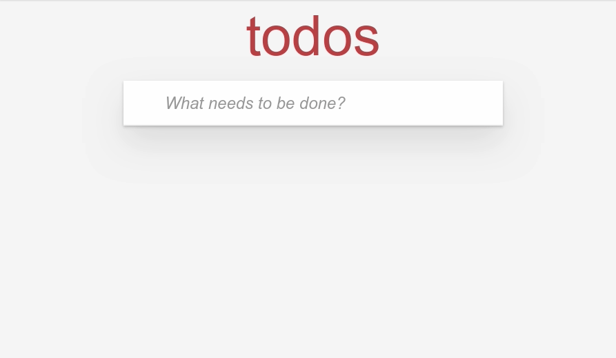

# svelte-firebase-rxjs-todo-app

This is example code for my blog post - [How to build a Todo app with RxJS, Svelte and Firebase](https://codechips.me/how-to-build-todo-app-with-svelte-rxjs-firebase/).

## Requirements

A working Java environment. Required by Firebase Emulator.

## How to run

- Install firebase-tools `npm i -g firebase-tools`
- Login to firebase `firebase login`
- Clone and run `npm i && npm start`

## There is more!

For more interesting stuff like this follow me on [Twitter](https://twitter.com/codechips) or check out my blog https://codechips.me

